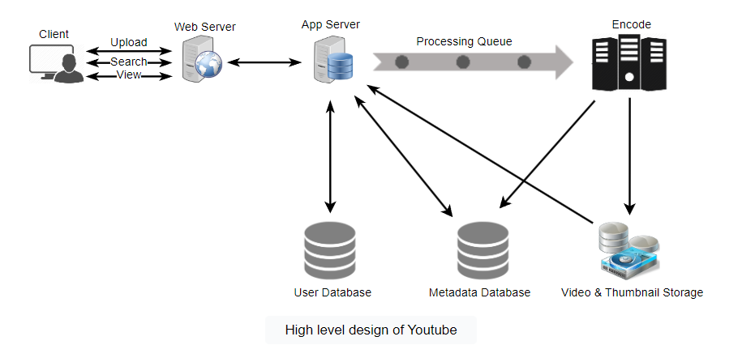
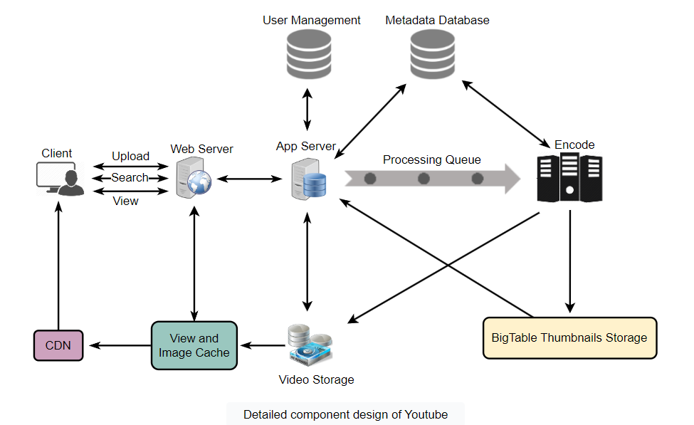

# NETFLIX System design | software architecture for netflix

https://www.youtube.com/watch?v=psQzyFfsUGU&list=PLkQkbY7JNJuC99VDJcpQdww-4aT3QhdJv&index=21

https://www.linkedin.com/pulse/system-design-netflix-narendra-l/?published=t

**System Design:**


Netflix operates in two clouds: **AWS and Open Connect.**

Both clouds must work together seamlessly to deliver endless hours of customer-pleasing video.

Netflix has 3 main components which we are going to discuss today

* OC or netflix CDN
* backend
* client

Lets first talk about some high level working of Netflix and then jump in to these 3 components.

The client is the user interface on any device used to browse and play Netflix videos. TV, XBOX, laptop or mobile phone etc

Anything that doesn’t involve serving video is handled in AWS.

Everything that happens after you hit play is handled by Open Connect. Open Connect is Netflix’s custom global content delivery network (CDN).

Open Connect stores Netflix video in different locations throughout the world. When you press play the video streams from Open Connect, into your device, and is displayed by the client.

CDN - A content delivery network (CDN) is a system of distributed servers (network) that deliver pages and other Web content to a user, based on the geographic locations of the user, the origin of the webpage and the content delivery server.

Before explaining system design i will walk you through the high level data flow/system working of Netflix. This helps to better understand the system components

**How Netflix onboard a movie/video:**

Before this movie is made available to users, Netflix must convert the video into a format that works best for your device. This process is called transcoding or encoding.

Transcoding is the process that converts a video file from one format to another, to make videos viewable across different platforms and devices.

Whys do we need to do it? why cant we just play the source video?

The original movie/video comes in a high definition format that’s many terabytes in size. Also Netflix supports 2200 different devices. Each device has a video format that looks best on that particular device. If you’re watching Netflix on an iPhone, you’ll see a video that gives you the best viewing experience on the iPhone.

Netflix also creates files optimized for different network speeds. If you’re watching on a fast network, you’ll see higher quality video than you would if you’re watching over a slow network. And also depends on your Netflix plan. that said netflix does create approx 1,200 files for every movie !!!!

Thats a lot of files and processing to do transcoding Now we have all the files we need to stream it. OC Open connect comes in to picture, OC is Netflix own CDN no third party CDN

**Advantages of OC**

* Less expensive
* Better quality
* More Scalable

So once the videos are transcoded these files are pushed to all of the OC servers.

**Now the second scenario:**

When user loads Netflix app All requests are handled by server in AWS Eg: Login, recommendations, home page, users history, billing, customer support etc. Now you want to watch a video, when you click play button of the Video. Your app automatically figures out the best OC server, best format and best bitrate for you and then the video is streamed from a nearby Open Connect Appliance (OCA) in the Open Connect CDN.

The Netfix apps are so intelligent that they constantly check for best streaming server and bitrate for you and switches between formats and servers to give best viewing experience for you.

Now what netflix does is with all of your search, viewing, location, device, reviews and likes data on AWS it uses Hadoop | Machine learning models to recommend new movies which you might like…

And this cycle goes on and on

Netflix supports 2200 different devices, including Smart TV, Adroid, IOS, gaming consoles, webapps etc

All these apps are written in platform specific code.

**Netflix Likes React JS:**

React was influenced by a number of factors, most notably: 1) startup speed, 2) runtime performance, and 3) modularity

**ELB:**

Netflix uses Amazons Elastic Load Balance (ELB) service to route traffic to our front end services. ELB’s are setup such that load is balanced across zones first, then instances. This is because the ELB is a two tier load balancing scheme.

* The first tier consists of basic DNS based round robin load balancing. This gets a client to an ELB endpoint in the cloud that is in one of the zones that your ELB is configured to use.
* The second tier of the ELB service is an array of load balancer instances (provisioned directly by AWS), which does round robin load balancing over our own instances that are behind it in the same zone.

**ZUUL:**

The Netty handlers on the front and back of the filters are mainly responsible for handling the network protocol, web server, connection management and proxying work. With those inner workings abstracted away, the filters do all of the heavy lifting.

The inbound filters run before proxying the request and can be used for authentication, routing, or decorating the request.

The endpoint filters can either be used to return a static response or proxy the request to the backend service (or origin as we call it).

The outbound filters run after a response has been returned and can be used for things like gzipping, metrics, or adding/removing custom headers.

Features:

* Supports http2
* mutual TLS
* Adaptive retries
* Concorrency protection for origin

It helps in Easy routing based on query params, url, path. The main use case is for routing traffic to a specific test or staging cluster.

**Advantages:**

* Services needing to shard their traffic create routing rules that map certain paths or prefixes to separate origins
* Developers onboard new services by creating a route that maps a new hostname to their new origin
* Developers run load tests by routing a percentage of existing traffic to a small cluster and ensuring applications will degrade gracefully under load
* Teams refactoring applications migrate to a new origin slowly by creating rules mapping traffic gradually, one path at a time
* Teams test changes (canary testing) by sending a small percentage of traffic to an instrumented cluster running the new build
* If teams need to test changes requiring multiple consecutive requests on their new build, they run sticky canary tests that route the same users to their new build for brief periods of time
* Security teams create rules that reject “bad” requests based on path or header rules across all Zuul clusters

**Hystrix**

Hystrix is a latency and fault tolerance library designed to isolate points of access to remote systems, services and 3rd party libraries. which helps in

1. Stop cascading failures
2. Realtime monitoring of configurations changes
3. Concurrency aware request caching
4. Automated batching through request collapsing

IE. If a micro service is failing then return the default response and wait until it recovers.

**Microservices:**

How APIS gets response?

Netflix uses MicroServices architecture to power all of the APIs needed for applications and Webapps. Each API calls the other micro services for required data and then responds with complete response

This setup works, but is it reliable?

1. We can use Hysterix which i aready explained
2. We separate critical services

**Critical Micro services:**

What netflix does is, they identify few service as critical (so that at last user can see recommended hit and play, in case of cascaded service failure) and these micro services works without many dependencies to other services !!

**Stateless Services:**

One of the major design goals of the Netflix architecture's is stateless services.

These services are designed such that any service instance can serve any request in a timely fashion and so if a server fails it’s not a big deal. In the failure case requests can be routed to another service instance and we can automatically spin up a new node to replace it.

**EVCache:**

When a node goes down all the cache goes down along with it. so performace hit until all the data is cached. so what netflix did is they came up with EVcache. It is wrapper around Memcached but it is sharded so multiple copies of cache is stored in sharded nodes. So everytime the write happens, all the shards are updated too..

When cache reads happens, read from nearest cache or nodes, but when a node is not available, read from different available node. It handles 30 million request a day and linear scalability with milliseconds latency.

**SSDs for Caching:**

Storing large amounts of data in volatile memory (RAM) is expensive. Modern disk technologies based on [SSD](https://en.wikipedia.org/wiki/Solid-state_drive) are providing fast access to data but at a much lower cost when compared to RAM. Hence, we wanted to move part of the data out of memory without sacrificing availability or performance. The cost to store 1 TB of data on SSD is much lower than storing the same amount in RAM.

**Database: (EC2 deployed MySQL)**

EC2 MySQL was ultimately the choice for the billing/user info use case, Netflix built MySQL using the InnoDB engine large ec2 instances. They even had master master like setup with “Synchronous replication protocol” was used to enable the write operations on the primary node to be considered completed. Only after both the local and remote writes have been confirmed.

As a result, the loss of a single node is guaranteed to have no data loss. This would impact the write latency, but that was well within the SLAs.

Read replica setup in local, as well as cross region, not only met high availability requirements, but also helped with scalability.

The read traffic from ETL jobs was diverted to the read replica, sparing the primary database from heavy ETL batch processing. In case of the primary MySQL database failure, a failover is performed to the secondary node that was being replicated in synchronous mode. Once secondary node takes over the primary role, the route53 DNS entry for database host is changed to point to the new primary.

**Cassandra: -> 500 nodes 50 clusters**

[https://medium.com/netflix-techb...](https://medium.com/netflix-techblog/scaling-time-series-data-storage-part-i-ec2b6d44ba39)

Cassandra is a free and open-source distributed wide column store NoSQL database designed to handle large amounts of data across many commodity servers, providing high availability with no single point of failure

At Netflix as userbase started to grow more there has been a massive increase in viewing history data.

Initial days it was fine, but not for long

So Netflix Redesigned data storage arch with two main goals in mind:

* Smaller Storage Footprint.
* Consistent Read/Write Performance as viewing per member grows.

So the solution: Compress the old rows!! Data was divided in to two types

Live Viewing History (LiveVH): Small number of recent viewing records with frequent updates. The data is stored in uncompressed form as in the simple design detailed above.

Compressed Viewing History (CompressedVH): Large number of older viewing records with rare updates. The data is compressed to reduce storage footprint. Compressed viewing history is stored in a single column per row key.

Kafka to chukwa for distribute system monitoring

Push all the netflix events to processing pipelines

~500 billion events and ~1.3 PB per day

~8 million events and ~24 GB per second during peak hours

What kind of events??

* Video viewing activities
* UI activities
* Error logs
* Performance events
* Troubleshooting & diagnostic events

[https://chukwa.apache.org/](https://chukwa.apache.org/)

**Apache Chukwa** is an open source data collection system for monitoring large distributed systems. Apache Chukwa is built on top of the Hadoop Distributed File System (HDFS) and Map/Reduce framework and inherits Hadoop’s scalability and robustness.

Apache Chukwa also includes a flexible and powerful toolkit for displaying, monitoring and analyzing results to make the best use of the collected data.

The kafka routing service is responsible for moving data from fronting Kafka to various sinks: S3, Elasticsearch, and secondary Kafka.

Routing is done using apache Samza

When Chukwa sends traffic to Kafka, it can deliver full or filtered streams. Sometimes, we need to apply further filtering on the Kafka streams written from Chukwa. That is why we have the router to consume from one Kafka topic and produce to a different Kafka topic.

**Elastic search**

We have seen explosive growth in Elastic search adoption within Netflix for the last two years. There are ~150 clusters totaling ~3,500 instances hosting ~1.3 PB of data. The vast majority of the data is injected via our data pipeline.

How its used at Netflix

Say when a customer tried to play a video and he couldn’t, he calls the customer care now how customer care guys can debug whats happening? So Playback team uses Elastic search to drill down the problem and also to understand how widespread is the problem.

* To see Signup or login problems
* To keep track of resource usage

**AWS Application Auto Scaling feature - TITUS**

[https://medium.com/netflix-techb...](https://medium.com/netflix-techblog/auto-scaling-production-services-on-titus-1f3cd49f5cd7)

Titus is a container management platform that provides scalable and reliable container execution and cloud-native integration with Amazon AWS.

Titus was built internally at Netflix and is used in production to power Netflix streaming, recommendation, and content systems.

It also has scheduling support for service applications. Mainly used to scale docker images, It talks to AWS auto scale service using AWS API gateways to scale dockers on AWS.

AWS auto scale can scale instances, Titus will scale instances and also dockers based on the traffic conditions. As Netflix has many micro services on docker.

For example, as people on the east coast of the U.S. return home from work and turn on Netflix, services automatically scale up to meet this demand. Scaling dynamically with demand rather than static sizing helps ensure that services can automatically meet a variety of traffic patterns without service owners needing to size and plan their desired capacity. Additionally, dynamic scaling enables cloud resources that are not needed to be used for other purposes, such as encoding new content.

This design centered around the AWS Auto Scaling engine being able to compute the desired capacity for a Titus service, relay that capacity information to Titus, and for Titus to adjust capacity by launching new or terminating existing containers. There were several advantages to this approach. First, Titus was able to leverage the same proven auto scaling engine that powers AWS rather than having to build our own. Second, Titus users would get to use the same Target Tracking and Step Scaling policies that they were familiar with from EC2. Third, applications would be able to scale on both their own metrics, such as request per second or container CPU utilization, by publishing them to CloudWatch as well as AWS-specific metrics, such as SQS queue depth. Fourth, Titus users would benefit from the new auto scaling features and improvements that AWS introduces.

The key challenge was enabling the AWS Auto Scaling engine to call the Titus control plane running in Netflix’s AWS accounts. To address this, we leveraged AWS [API Gateway](https://aws.amazon.com/api-gateway/), a service which provides an accessible API “front door” that AWS can call and a backend that could call Titus. API Gateway exposes a common API for AWS to use to adjust resource capacity and get capacity status while allowing for pluggable backend implementations of the resources being scaled, such as services on Titus. When an auto scaling policy is configured on a Titus service, Titus creates a new scalable target with the AWS Auto Scaling engine.

**Media processing while on boarding and later**

 **Validating the video** : The first thing Netflix does is spend a lot of time validating the video. It looks for digital artifacts, color changes, or missing frames that may have been caused by previous transcoding attempts or data transmission problems.

The video is rejected if any problems are found.

After the video is validated, it’s fed into what Netflix calls the media pipeline.

A pipeline is simply a series of steps data is put through to make it ready for use, much like an assembly line in a factory. More than 70 different pieces of software have a hand in creating every video.

It’s not practical to process a single multi-terabyte sized file, so the first step of the pipeline is to break the video into lots of smaller chunks.

The video chunks are then put through the pipeline so they can be encoded in parallel. In parallel simply means the chunks are processed at the same time

**Archer**

Archer is an easy to use MapReduce style platform for media processing that uses containers so that users can bring their OS-level dependencies. Common media processing steps such as mounting video frames are handled by the platform. Developers write three functions: split, map and collect; and they can use any programming language. Archer is explicitly built for simple media processing at scale, and this means the platform is aware of media formats and gives white glove treatment for popular media formats.

For example, a PRORES video frame is a first class object in Archer and splitting a video source into shot based chunks [1] is supported out of the box (a shot is a fragment of the video where the camera doesn’t move).

1. detecting dead pixels caused by defective digital camera
2. machine learning (ML) to tag audio
3. QC for subtitles

**SPARK Usage for recommendation**

Spark is used for content recommendations and personalization. A majority of the machine learning pipelines for member personalization run atop large managed Spark clusters. These models form the basis of the recommender system that backs the various personalized canvases you see on the Netflix app including, title relevance ranking, row selection & sorting, and artwork personalization among others.

Netflix personalizes artwork just for you

Here’s a great example of how Netflix entices you to watch more videos using its data analytics capabilities.

When browsing around looking for something to watch on Netflix, have you noticed there’s always an image displayed for each video? That’s called the header image.

The header image is meant to intrigue you, to draw you into selecting a video. The idea is the more compelling the header image, the more likely you are to watch a video. And the more videos you watch, the less likely you are to unsubscribe from Netflix.

Here’s an example of different header images for Stranger Things:


You might be surprised to learn the image shown for each video is selected specifically for you. Not everyone sees the same image.

Everyone used to see the same header image. Here’s how it worked. Members were shown at a random one picture from a group of options, like the pictures in the above Stranger Things collage. Netflix counted every time the video was watched, recording which picture was displayed when the video was selected.

For our Stranger Things example, let’s say when the group picture in the center was shown, Stranger Things was watched 1,000 times. For all the other pictures, it was watched only once each.

Since the group picture was the best at getting members to watch, Netflix would make it the header image for Stranger Things forever.

This is called being data-driven. Netflix is known for being a data-driven company. Data is gathered—in this case, the number of views associated with each picture—and used to make the best decisions possible—in this case, which header image to select.

Clever, but can you imagine doing better? Yes, by using more data. That’s the theme of the future—solving problems by learning from data.

You and I are likely very different people. Do you think we are motivated by the same kind of header image? Probably not. We have different tastes. We have different preferences.

Netflix knows this too. That’s why Netflix now personalizes all the images they show you. Netflix tries to select the artwork highlighting the most relevant aspect of a video to you. How do they do that?

Remember, Netflix records and counts everything you do on their site. They know which kind of movies you like best, which actors you like the most, and so on.

**How Netflix’s Recommendations System Works**

[https://beta.vu.nl/nl/Images/wer...](https://beta.vu.nl/nl/Images/werkstuk-fernandez_tcm235-874624.pdf)

Whenever you access the Netflix service, our recommendations system strives to help you find a show or movie to enjoy with minimal effort. We estimate the likelihood that you will watch a particular title in our catalog based on a number of factors including:

• your interactions with our service (such as your viewing history and how you rated other titles),

• other members with similar tastes and preferences on our service ([more info here](https://media.netflix.com/en/company-blog/a-global-approach-to-recommendations)), and

• information about the titles, such as their genre, categories, actors, release year, etc.

In addition to knowing what you have watched on Netflix, to best personalize the recommendations we also look at things like:

• the time of day you watch,

• the devices you are watching Netflix on, and

• how long you watch.

**Collaborative filtering The Collaborative Filtering (CF)** algorithms are based on the idea that if two clients have similar rating history then they will behave similarly in the future (Breese, Heckerman, and Kadie, 1998). If, for example, there are two very likely users and one of them watches a movie and rates it with a good score, then it is a good indication that the second user will have a similar pattern

**Content-based filtering The Content-based filtering (CB)** aims to recommend items or movies that are alike to movies the user has liked before. The main difference between this approach and the CF is that CB offers the recommendation based not only in similarity by rating, but it is more about the information from the products (Aggarwal, 2016), i.e., the movie title, the year, the actors, the genre. In order to implement this methodology, it is necessary to possess information describing each item, and some sort of user profile describing what the user likes is also desirable. The task is to learn the user preferences, and then locate or recommend items that are "similar" to the user preferences

**Hybrid filtering** The hybrid methods are characterized by combining CF and CB techniques


# Designing Youtube or Netflix

https://www.educative.io/courses/grokking-the-system-design-interview/xV26VjZ7yMl


## . Why Youtube?

Youtube is one of the most popular video sharing websites in the world. Users of the service can upload, view, share, rate, and report videos as well as add comments on videos.

## 2. Requirements and Goals of the System

For the sake of this exercise, we plan to design a simpler version of Youtube with following requirements:

**Functional Requirements:**

1. Users should be able to upload videos.
2. Users should be able to share and view videos.
3. Users should be able to perform searches based on video titles.
4. Our services should be able to record stats of videos, e.g., likes/dislikes, total number of views, etc.
5. Users should be able to add and view comments on videos.

**Non-Functional Requirements:**

1. The system should be highly reliable, any video uploaded should not be lost.
2. The system should be highly available. Consistency can take a hit (in the interest of availability); if a user doesn’t see a video for a while, it should be fine.
3. Users should have a real-time experience while watching videos and should not feel any lag.

**Not in scope:** Video recommendations, most popular videos, channels, subscriptions, watch later, favorites, etc.

## 3. Capacity Estimation and Constraints

Let’s assume we have 1.5 billion total users, 800 million of whom are daily active users. If, on average, a user views five videos per day then the total video-views per second would be:

800M * 5 / 86400 sec => 46K videos/secLet’s assume our upload:view ratio is 1:200, i.e., for every video upload we have 200 videos viewed, giving us 230 videos uploaded per second.

46K / 200 => 230 videos/sec**Storage Estimates:** Let’s assume that every minute 500 hours worth of videos are uploaded to Youtube. If on average, one minute of video needs 50MB of storage (videos need to be stored in multiple formats), the total storage needed for videos uploaded in a minute would be:

500 hours * 60 min * 50MB => 1500 GB/min (25 GB/sec)These are estimated numbers ignoring video compression and replication, which would change real numbers.

**Bandwidth estimates:** With 500 hours of video uploads per minute (which is 30000 mins of video uploads per minute), assuming uploading each minute of the video takes 10MB of the bandwidth, we would be getting 300GB of uploads every minute.

500 hours * 60 mins * 10MB => 300GB/min (5GB/sec)Assuming an upload:view ratio of 1:200, we would need 1TB/s outgoing bandwidth.

## 4. System APIs

We can have SOAP or REST APIs to expose the functionality of our service. The following could be the definitions of the APIs for uploading and searching videos:

```
uploadVideo(api_dev_key, video_title, video_description, tags[], category_id, default_language, recording_details, video_contents)
```

**Parameters:**
api_dev_key (string): The API developer key of a registered account. This will be used to, among other things, throttle users based on their allocated quota.
video_title (string): Title of the video.
video_description (string): Optional description of the video.
tags (string[]): Optional tags for the video.
category_id (string): Category of the video, e.g., Film, Song, People, etc.
default_language (string): For example English, Mandarin, Hindi, etc.
recording_details (string): Location where the video was recorded.
video_contents (stream): Video to be uploaded.

**Returns:** (string)
A successful upload will return HTTP 202 (request accepted) and once the video encoding is completed the user is notified through email with a link to access the video. We can also expose a queryable API to let users know the current status of their uploaded video.

```
searchVideo(api_dev_key, search_query, user_location, maximum_videos_to_return, page_token)
```

**Parameters:**
api_dev_key (string): The API developer key of a registered account of our service.
search_query (string): A string containing the search terms.
user_location (string): Optional location of the user performing the search.
maximum_videos_to_return (number): Maximum number of results returned in one request.
page_token (string): This token will specify a page in the result set that should be returned.

**Returns:** (JSON)
A JSON containing information about the list of video resources matching the search query. Each video resource will have a video title, a thumbnail, a video creation date, and a view count.

```
streamVideo(api_dev_key, video_id, offset, codec, resolution)
```

**Parameters:**
api_dev_key (string): The API developer key of a registered account of our service.
video_id (string): A string to identify the video.
offset (number): We should be able to stream video from any offset; this offset would be a time in seconds from the beginning of the video. If we support playing/pausing a video from multiple devices, we will need to store the offset on the server. This will enable the users to start watching a video on any device from the same point where they left off.
codec (string) & resolution(string): We should send the codec and resolution info in the API from the client to support play/pause from multiple devices. Imagine you are watching a video on your TV’s Netflix app, paused it, and started watching it on your phone’s Netflix app. In this case, you would need codec and resolution, as both these devices have a different resolution and use a different codec.

**Returns:** (STREAM)
A media stream (a video chunk) from the given offset.

## 5. High Level Design

At a high-level we would need the following components:

1. **Processing Queue:** Each uploaded video will be pushed to a processing queue to be de-queued later for encoding, thumbnail generation, and storage.
2. **Encoder:** To encode each uploaded video into multiple formats.
3. **Thumbnails generator:** To generate a few thumbnails for each video.
4. **Video and Thumbnail storage:** To store video and thumbnail files in some distributed file storage.
5. **User Database:** To store user’s information, e.g., name, email, address, etc.
6. **Video metadata storage:** A metadata database to store all the information about videos like title, file path in the system, uploading user, total views, likes, dislikes, etc. It will also be used to store all the video comments.

**High level design of Youtube**



## 6. Database Schema

**Video metadata storage - MySql**
Videos metadata can be stored in a SQL database. The following information should be stored with each video:

* VideoID
* Title
* Description
* Size
* Thumbnail
* Uploader/User
* Total number of likes
* Total number of dislikes
* Total number of views

For each video comment, we need to store following information:

* CommentID
* VideoID
* UserID
* Comment
* TimeOfCreation

**User data storage - MySql**

* UserID, Name, email, address, age, registration details, etc.

## 7. Detailed Component Design

The service would be read-heavy, so we will focus on building a system that can retrieve videos quickly. We can expect our read:write ratio to be 200:1, which means for every video upload, there are 200 video views.

**Where would videos be stored?** Videos can be stored in a distributed file storage system like [HDFS](https://en.wikipedia.org/wiki/Apache_Hadoop#HDFS) or [GlusterFS](https://en.wikipedia.org/wiki/GlusterFS).

**How should we efficiently manage read traffic?** We should segregate our read traffic from write traffic. Since we will have multiple copies of each video, we can distribute our read traffic on different servers. For metadata, we can have primary-secondary configurations where writes will go to primary first and then get applied at all the secondaries. Such configurations can cause some staleness in data, e.g., when a new video is added, its metadata would be inserted in the primary first, and before it gets applied to the secondary, our secondaries would not be able to see it; and therefore, it will be returning stale results to the user. This staleness might be acceptable in our system as it would be very short-lived, and the user would be able to see the new videos after a few milliseconds.

**Where would thumbnails be stored?** There will be a lot more thumbnails than videos. If we assume that every video will have five thumbnails, we need to have a very efficient storage system that can serve huge read traffic. There will be two consideration before deciding which storage system should be used for thumbnails:

1. Thumbnails are small files, say, a maximum of 5KB each.
2. Read traffic for thumbnails will be huge compared to videos. Users will be watching one video at a time, but they might be looking at a page with 20 thumbnails of other videos.

Let’s evaluate storing all the thumbnails on a disk. Given that we have a huge number of files, we have to perform many seeks to different locations on the disk to read these files. This is quite inefficient and will result in higher latencies.

[Bigtable](https://en.wikipedia.org/wiki/Bigtable) can be a reasonable choice here as it combines multiple files into one block to store on the disk and is very efficient in reading a small amount of data. Both of these are the two most significant requirements for our service. Keeping hot thumbnails in the cache will also help improve the latencies and, given that thumbnails files are small in size, we can easily cache a large number of such files in memory.

**Video Uploads:** Since videos could be huge, if while uploading, the connection drops, we should support resuming from the same point.

**Video Encoding:** Newly uploaded videos are stored on the server, and a new task is added to the processing queue to encode the video into multiple formats. Once all the encoding is completed, the uploader will be notified, and the video is made available for view/sharing.

**Detailed component design of Youtube**



## 8. Metadata Sharding

Since we have a huge number of new videos every day and our read load is extremely high, therefore, we need to distribute our data onto multiple machines so that we can perform read/write operations efficiently. We have many options to shard our data. Let’s go through different strategies of sharding this data one by one:

**Sharding based on UserID:** We can try storing all the data for a particular user on one server. While storing, we can pass the UserID to our hash function, which will map the user to a database server where we will store all the metadata for that user’s videos. While querying for videos of a user, we can ask our hash function to find the server holding the user’s data and then read it from there. To search videos by titles, we will have to query all servers, and each server will return a set of videos. A centralized server will then aggregate and rank these results before returning them to the user.

This approach has a couple of issues:

1. What if a user becomes popular? There could be a lot of queries on the server holding that user; this could create a performance bottleneck. This will also affect the overall performance of our service.
2. Over time, some users can end up storing a lot of videos compared to others. Maintaining a uniform distribution of growing user data is quite tricky.

To recover from these situations, either we have to repartition/redistribute our data or used consistent hashing to balance the load between servers.

**Sharding based on VideoID:** Our hash function will map each VideoID to a random server where we will store that Video’s metadata. To find videos of a user, we will query all servers, and each server will return a set of videos. A centralized server will aggregate and rank these results before returning them to the user. This approach solves our problem of popular users but shifts it to popular videos.

We can further improve our performance by introducing a cache to store hot videos in front of the database servers.

## 9. Video Deduplication

With a huge number of users uploading a massive amount of video data, our service will have to deal with widespread video duplication. Duplicate videos often differ in aspect ratios or encodings, contain overlays or additional borders, or be excerpts from a longer original video. The proliferation of duplicate videos can have an impact on many levels:

1. Data Storage: We could be wasting storage space by keeping multiple copies of the same video.
2. Caching: Duplicate videos would result in degraded cache efficiency by taking up space that could be used for unique content.
3. Network usage: Duplicate videos will also increase the amount of data that must be sent over the network to in-network caching systems.
4. Energy consumption: Higher storage, inefficient cache, and network usage could result in energy wastage.

For the end-user, these inefficiencies will be realized in the form of duplicate search results, longer video startup times, and interrupted streaming.

For our service, deduplication makes most sense early; when a user is uploading a video as compared to post-processing it to find duplicate videos later. Inline deduplication will save us a lot of resources that can be used to encode, transfer, and store the duplicate copy of the video. As soon as any user starts uploading a video, our service can run video matching algorithms (e.g., [Block Matching](https://en.wikipedia.org/wiki/Block-matching_algorithm), [Phase Correlation](https://en.wikipedia.org/wiki/Phase_correlation), etc.) to find duplications. If we already have a copy of the video being uploaded, we can either stop the upload and use the existing copy or continue the upload and use the newly uploaded video if it is of higher quality. If the newly uploaded video is a subpart of an existing video or vice versa, we can intelligently divide the video into smaller chunks so that we only upload the parts that are missing.

## 10. Load Balancing

We should use [Consistent Hashing](https://www.educative.io/collection/page/5668639101419520/5649050225344512/5709068098338816/) among our cache servers, which will also help in balancing the load between cache servers. Since we will be using a static hash-based scheme to map videos to hostnames, it can lead to an uneven load on the logical replicas due to each video’s different popularity. For instance, if a video becomes popular, the logical replica corresponding to that video will experience more traffic than other servers. These uneven loads for logical replicas can then translate into uneven load distribution on corresponding physical servers. To resolve this issue, any busy server in one location can redirect a client to a less busy server in the same cache location. We can use dynamic HTTP redirections for this scenario.

However, the use of redirections also has its drawbacks. First, since our service tries to load balance locally, it leads to multiple redirections if the host that receives the redirection can’t serve the video. Also, each redirection requires a client to make an additional HTTP request; it also leads to higher delays before the video starts playing back. Moreover, inter-tier (or cross data-center) redirections lead a client to a distant cache location because the higher tier caches are only present at a small number of locations.

## 11. Cache

To serve globally distributed users, our service needs a massive-scale video delivery system. Our service should push its content closer to the user using a large number of geographically distributed video cache servers. We need to have a strategy that will maximize user performance and also evenly distributes the load on its cache servers.

We can introduce a cache for metadata servers to cache hot database rows. Using Memcache to cache the data and Application servers before hitting the database can quickly check if the cache has the desired rows. Least Recently Used (LRU) can be a reasonable cache eviction policy for our system. Under this policy, we discard the least recently viewed row first.

**How can we build a more intelligent cache?** If we go with the 80-20 rule, i.e., 20% of daily read volume for videos is generating 80% of traffic, meaning that certain videos are so popular that the majority of people view them; it follows that we can try caching 20% of daily read volume of videos and metadata.

## 12. Content Delivery Network (CDN)

A CDN is a system of distributed servers that deliver web content to a user based on the user’s geographic locations, the origin of the web page, and a content delivery server. Take a look at the ‘CDN’ section in [Caching](https://www.educative.io/courses/grokking-the-system-design-interview/3j6NnJrpp5p) chapter.

Our service can move popular videos to CDNs:

* CDNs replicate content in multiple places. There’s a better chance of videos being closer to the user and, with fewer hops, videos will stream from a friendlier network.
* CDN machines make heavy use of caching and can mostly serve videos out of memory.

Less popular videos (1-20 views per day) that are not cached by CDNs can be served by our servers in various data centers.

## 13. Fault Tolerance

We should use [Consistent Hashing](https://www.educative.io/collection/page/5668639101419520/5649050225344512/5709068098338816/) for distribution among database servers. Consistent hashing will not only help in replacing a dead server but also help in distributing load among servers.
